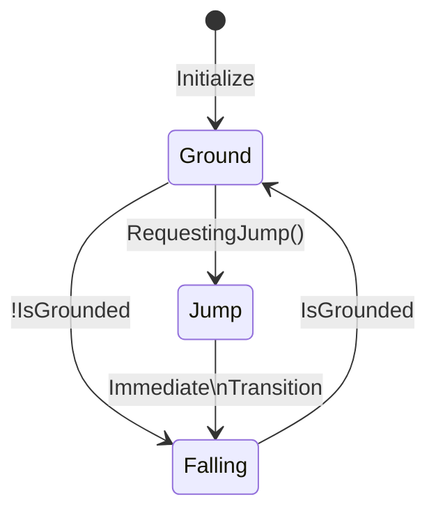

# Player Movement

### This includes files:
- [PlayerMovement.cs](../Global/Scripts/PlayerMovement/PlayerMovement.cs)
- [PlayerStateMachine.cs](../Global/Scripts/PlayerMovement/PlayerStateMachine.cs)
- [PlayerOrientation.cs](../Global/Scripts/PlayerMovement/PlayerOrientation.cs)
- [GroundCheckData.cs](../Global/Scripts/PlayerMovement/GroundCheckData.cs)
- [States / PlayerBaseState.cs](../Global/Scripts/PlayerMovement/States/PlayerBaseState.cs)
- [States / PlayerGroundState.cs](../Global/Scripts/PlayerMovement/States/PlayerGroundState.cs)
- [States / PlayerJumpState.cs](../Global/Scripts/PlayerMovement/States/PlayerJumpState.cs)
- [States / PlayerFallingState.cs](../Global/Scripts/PlayerMovement/States/PlayerFallingState.cs)
---
# Questions that might arise
### How do I add the player to my scene?
Just drag and drop the prefab `Player` in the scene. It should work then.
Make sure that you also remove the default camera

### Why does the movement has its own gravity / why does the character tilt on angled platforms?
1. If you look at any 4 legged mammal, their legs are always aligned with the floor underneath. one way to do this, is rotate the player with the floors normal.
2. We are working with a squirrel, that also has to be able to climb pretty much any surface if we so chose. It should also work with any kind of slope like trees, rocks, and hanging branches. And it should also actually look like you are climbing
3. We dont want to change the gravity of the whole scene. So changing gravity in project settings are out of the question  

Rotating The player with the floors normal, and applying a custom gravity are 2 separate things course. 
But both pretty much use the same principle. so I thought I would just combine them in this section.

### Why not use the Unity CharacterController?
The Unity CharacterController is a great tool for simple movement, but it has some limitations.
For one, you cant rotate the collider that comes with this characterController.
I thought just writing it myself would be easier than trying to work around this limitation. ¯\(°_o)/¯

### Why do we have a state machine?
The movement that we envisioned for the squirrel has a lot of different aspects to it.
Walking, running, jumping, climbing, falling, gliding, i even heard a grappling hook. 
If we want to keep it organized, we should do it using a state diagram. That's for sure. (however, i am not so sure about the current implementation lol)

### Why do we have the GroundCheckData.cs?
Check [this file](../Global/Scripts/PlayerMovement/GroundCheckData.cs) if you didnt see it yet. Its just a simple struct that contains all the data that are relevant to the ground / downwards gravity.

Some states, like climbing, might have different requirements for this gravity. and so we want to be able to override the method that calculates this gravity.
All these 3 attributes require you to do a raycast to the ground. In fact, the exact same raycast. They are also always calculated each FixedUpdate in sequence.
So we can either:
1. redo the same raycast 3 times in sequence.
2. rely on the order of the 3 methods, and use the saved date from one in the other (This is just asking for bugs, since someone might change the order without knowing,
   and its also not really noticeable if you re-ordered them. Then a method will be using the wrong data from the previous fixedUpdate)
3. (this) make a class that contains all the data, and just combine the 3 methods in to 1 that returns this class.
---
# Code explanation

### Method RotatePlayerObject(.., ..) in PlayerMovement.cs
This method is responsible for rotating the player asif it was standing on that surface.
The first parameter therefore is the normal of the surface.
The second parameter is the velocity of the player. This way, if there is any movement, the player will rotate in the direction of the movement.
If there is no movement, the player will ignore its facing direction, but it will still rotate with the surface.

# The state machine:
We try to write anything that can be changed per state, in the state itself.
Things like `ApplyGravity` might be something we change in the future, so we put it in the baseState so that we can override it later.
But things like `RotatePlayerObject` is more of a helper method, where you enter 2 vectors that decide the rotation.
But the 2 vectors (velocity and gravity), they can be changed by the state.
And things like the jump cooldown, that cant be in a state since you still want to count up the cooldown even if you are switching between states.

The [BaseState](../Global/Scripts/PlayerMovement/States/PlayerBaseState.cs) is the base class for all the states.
Here are all the methods that you can override. Note that some methods are already implemented, since they are most of the time the same.
Like checking whether the player is grounded or not. or the gravity calculation.

The [Ground](../Global/Scripts/PlayerMovement/States/PlayerGroundState.cs) has the full basic movement, 
You can also consider this the walking/sprinting/idle state. Maybe in the future we might want to split this up.
But for now, idle is not that much of a difference from walking, just with 0 movement speed.

The [Falling](../Global/Scripts/PlayerMovement/States/PlayerFallingState.cs) state is the state where the player is not grounded.
This state has still the same movement control as the ground state, but has reduced movement (depending on the inspector value).
In this state the gravity calculation is also overridden, since if the player is falling, we already know the gravity is Vector3.down anyways.
However, the down that the model is rotated to, we slowly lerp to that instead of instantly rotating to it.

The [Jump](../Global/Scripts/PlayerMovement/States/PlayerJumpState.cs) state is the state where the player is jumping.
This state instantly applies a jump force, and then goes to the falling state. 
There fore this state also didnt override the FixedUpdate method, since it will never reach that point anyways.

# Adding a new state:
1. Create a new script in the States folder that inherits from [PlayerBaseState](../Global/Scripts/PlayerMovement/States/PlayerBaseState.cs)
2. Go in the [PlayerStateMachine](../Global/Scripts/PlayerMovement/PlayerStateMachine.cs) and add a new state to the enum
3. then in the same PlayerStateMachine file, go to the dictionary `this._states` and add the state class to the dictionary.  

This is it. Now you can implement the behavior of this state, and set conditions to enter and exit this state.
Simply by calling the method `this.StateMachine.ChangeState(PlayerStateType.MyNewState);`
